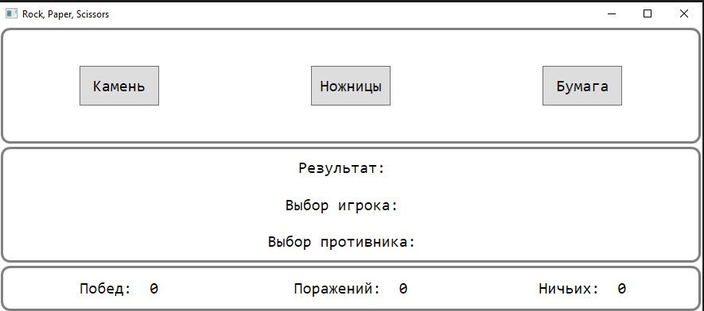
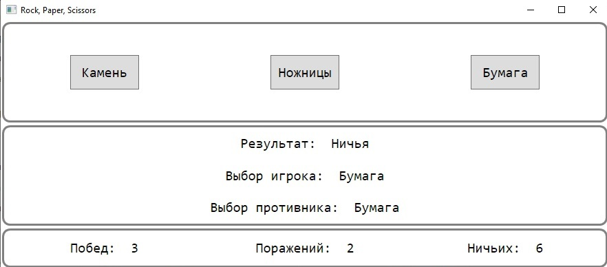

# Игра 'Камень ножницы бумага'

«Камень, ножницы, бумага» — популярная игра на руках, часто использующаяся как способ жеребьёвки для определения очерёдности хода или ведущего в других играх. 

Игроки считают вместе вслух «Камень… Ножницы… Бумага… Раз… Два… Три», одновременно качая кулаками.
На счёт «Три» они одновременно показывают при помощи руки один из трёх знаков: камень, ножницы или бумагу. 

Победитель определяется по следующим правилам:

    Бумага побеждает камень («бумага обёртывает камень»).
    Камень побеждает ножницы («камень затупляет ножницы»).
    Ножницы побеждают бумагу («ножницы разрезают бумагу»).

Если игроки показали одинаковый знак, то засчитывается ничья и игра переигрывается. 

### Пример работы программы.

